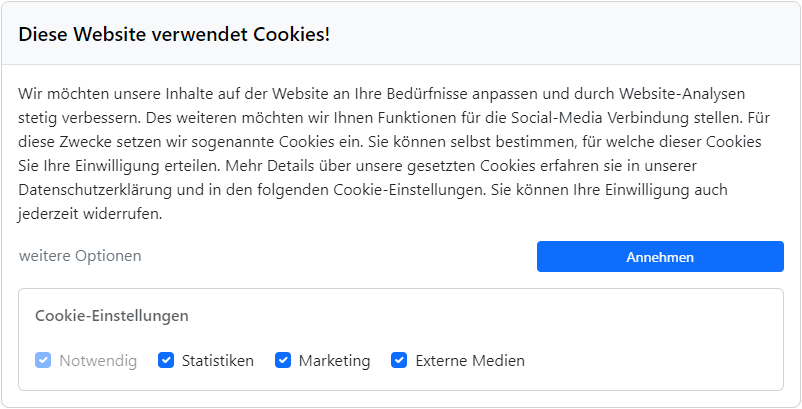

# Software zur Datenerhebung für Bachelorarbeit

Im Rahmen meiner Bachelorarbeit zur Untersuchung der Wirkung von Dark-Patterns in Cookie-Bannern wurde diese Software entwickelt, um die nötigen Daten zu sammeln. 
Dabei wurde hauptsächlich <b>PHP</b> und <b>MySQL</b> sowie <b>HTML</b> eingesetzt. Zur Gestaltung wurde <b>Bootstrap (5.3)</b> verwendet.

## Ziel der Software

Ziel war es, dass die Teilnehmer des Experiments verschiedene Cookie-Banner verwenden,
damit unterschiedliche Designs im Bezug auf Erfolg (Cookies akzeptiert) untersucht werden können.

Die Teilnehmer hatten die Aufgabe auf verschiedenen Websites sächsicher Bildungseinrichtungen das Impressum zu lokalisieren. 
Bei jedem Aufruf einer Seite wurde zufällig einer von vier verschiedenen Cookie-Bannern eingeblendet. 
Bei Verwendung wurde der gewählte Button sowie die gewählten Optionen gespeichert.

Nach diesem Experiment fand eine Umfrage statt, um die Daten in Zusammenhänge, wie beispielsweise mit dem Alter, setzen zu können.

## Beispiel eines Banners

